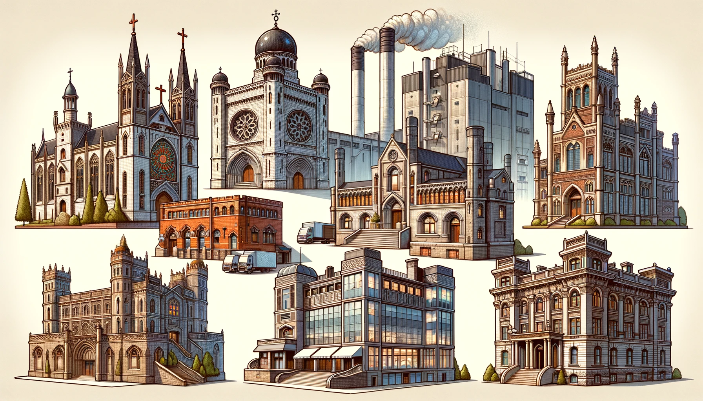
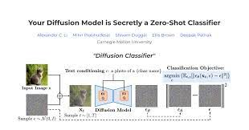
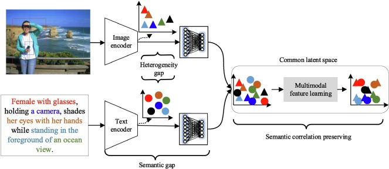

# Multi Modal Diffusion Model For 3D Building Classification

# Introduction 

3D building classification is the computational process of categorizing three-dimensional representations of architectural structures. This involves analyzing volumetric data to percieve distinct architectural features,spatial configurations,and other instrinisc characterstics of buildings.

We've developed a methodology that intergrates a generative capabilities with classification strengths. At the core of our approach is a hierarchical latent space that captures features of 3D building structures. This representation is then subjected to a diffusion process ,which perturbs the data iteratively. Post-diffusion, a deep neural network is employed to denoise the data, extracting essential features that are crucial for classification.

Following the denoising, a classification model is introduced which predicts the building category based on the denoised latent representation. Our system is designed to handle multi-modal data, allowing it to process and integrate information from various data types, enhancing its classification accuracy.

# Problem Definition 

**Deep Generative Models (Diffusion Models)**:

These models are at the forefront of machine learning research, particularly for their ability to generate new, previously unseen data samples that closely resemble the distribution of the training data. One of the prominent types of generative models is the "Diffusion Model." As the name suggests, these models employ a diffusion process, which can be visualized as a gradual spreading or dispersing mechanism. The core idea is to start with random noise, which is essentially unstructured data, and then iteratively refine this noise through the diffusion process until it morphs into a structured data sample that aligns with the training data's characteristics.

**Recognizing 3D Buildings:**

While the generation of new data samples is fascinating, the primary task at hand is the recognition and classification of three-dimensional representations of buildings. This involves analyzing the intricate details and features of 3D models to categorize them accurately. The challenge is not just about creating new 3D samples but more about understanding and classifying the existing ones based on their inherent attributes.

**3D Representation Types:**

To achieve accurate classification, it's essential to understand the various ways buildings can be represented in 3D:

- **Multiple Images:** This involves capturing different 2D views or angles of the building. By analyzing multiple perspectives, one can get a more comprehensive understanding of the building's 3D structure.

- **Point Clouds:** These are collections of data points in a 3D coordinate system. Each point represents a tiny portion of the external surfaces of the building, and together, they form a 3D representation of the structure. Point clouds are often derived from technologies like LIDAR.

- **Voxels:** Think of voxels as the 3D counterpart of 2D pixels. In a 3D space, voxels represent values on a regular grid. They can be used to create volumetric representations, where each voxel might denote the presence (or absence) of a part of the building.

- **SDF (Signed Distance Function):** This is a more mathematical representation. An SDF represents a shape in 3D space using a continuous function. For any given point in space, the function's value indicates the shortest distance between that point and the shape's surface. The "signed" aspect means that the distance is positive outside the shape and negative inside, providing a clear distinction between interior and exterior regions. This representation is particularly useful for complex geometries and can be employed in various computer graphics and computational geometry tasks.

# Approach Using Diffussion Model 

**Methodology:**

The core of this approach is inspired by the groundbreaking paper titled “Your Diffusion Model is Secretly a Zero-Shot Classifier”. This paper presents a novel perspective on diffusion models, suggesting that while they are primarily designed for generative tasks, they possess an inherent capability for classification, especially in scenarios where labeled data is scarce, termed as "Zero-Shot" classification. In essence, the diffusion process, which typically transforms random noise into structured data samples, can also be harnessed to determine the likelihood of a data sample belonging to a particular class.

**Building Net Dataset:**

This dataset serves as the foundation for the entire project. It comprises various 3D representations of buildings, and the models will be trained and tested on this data. The overarching objective is not just to fit the model to the data but to enhance its classification performance, ensuring it can accurately categorize different building types based on their 3D point-cloud representations.    

**Goal:**

The primary aim is to push the boundaries of what's achievable in terms of classification scores on the BuildingNet dataset. Specifically, the focus is on point-cloud representations of buildings. Point clouds, with their intricate details and depth, present unique challenges, and achieving high classification accuracy on them would signify a significant advancement in the field.

       

# Diffusion Model For Classification 

**Understanding Diffusion Models:**

Diffusion models are a subset of generative models that operate based on the principle of simulating a diffusion process. This process begins with a known data point and introduces random noise to it iteratively, diffusing it until it converges to a simple Gaussian noise. The reverse of this process, where the Gaussian noise is transformed back into a structured data sample, embodies the generative capability of the model. In essence, diffusion models mimic the natural process of diffusion to generate new data samples from random noise.

**Classification Via Denoising:**

A pivotal insight in the realm of diffusion models is their potential for classification through the denoising process. Traditionally, denoising aims to recover the original structure of data by reversing the noise addition. However, for classification, this denoising process can be conditioned on specific class labels. This means that during the denoising phase, the model can be instructed to generate a sample that aligns with a particular class. By observing how well the model denoises the data into a specific class, one can infer the likelihood of the data belonging to that class.

**Zero-Shot Classification:**

One of the standout capabilities of diffusion models is their aptitude for zero-shot classification. This involves classifying data into categories that the model hasn't encountered during its training phase. The methodology is as follows:

* Train the diffusion model as a generative model on a dataset without explicitly using class labels.
* During the classification phase, utilize the denoising process conditioned on class labels (including those not seen during training) to determine which class the model is most likely to generate.

**Scoring Mechanism:**

The scoring mechanism is integral to the classification process in diffusion models. Here's how it works:
* For each potential class, the reverse diffusion process (denoising) is executed, conditioned on that specific class.
* The model then measures the likelihood or score of the denoised sample aligning with each class.
* The data point is subsequently assigned to the class that yields the highest likelihood or score, effectively classifying it.

# LION (Latent Point Diffusion Models)

LION's foundation is built similarly to a "Variational Auto Encoder (VAE)". In simple terms, VAEs can compress complex data (like 3D shapes) into simpler representations and then decode or "unzip" these representations to recreate the original data. It is a specialized model designed for the generation of high-quality 3D shapes. At its core, LION utilizes a hierarchical latent space, which is a multi-level representation that captures both the global and detailed features of 3D structures. This hierarchical approach allows LION to compress intricate 3D shapes into simpler forms and then accurately recreate them, ensuring that the generated shapes retain their original intricacies and details.

# Combining LION with Diffusion Classifier

# Integration Strategy

The fusion of LION's generative prowess with the diffusion classifier's classification capabilities presents a groundbreaking approach in the realm of 3D building classification. At its core, this integration seeks to harness LION's ability to generate detailed 3D shapes and feed these generated structures into the diffusion classifier for precise categorization.

The process begins with LION generating a variety of 3D shapes. These shapes, rich in detail and diversity, are then subjected to the diffusion process. The diffusion classifier, conditioned on class labels, assesses these shapes, determining the likelihood of each shape belonging to a specific class based on its features. Essentially, the classifier evaluates how well it can denoise or reverse the diffusion process for a shape into a particular class, thereby inferring the class of the shape.

# Multi-modal Learning with LION

LION's design is inherently adaptable, making it a prime candidate for multi-modal learning. In the context of our research, multi-modal learning refers to the model's ability to process and integrate information from multiple types of data sources or formats to enhance classification accuracy.

For instance, LION can be conditioned on other modalities such as textual descriptions or 2D images. When a 3D model of a building is accompanied by a textual description like "Modern skyscraper with glass facade", LION can be trained to understand and integrate both the 3D structure and the text. Similarly, if there are 2D images or blueprints of the buildings, LION can incorporate this additional context to generate a more accurate 3D representation.

By integrating these additional modalities, the combined LION and diffusion classifier system becomes more robust. It can leverage the rich information from multiple sources, ensuring that the classification process is not only more accurate but also more informed, leading to better results in real-world scenarios.

